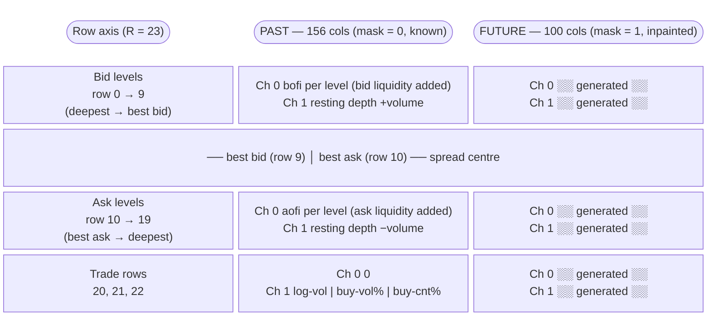
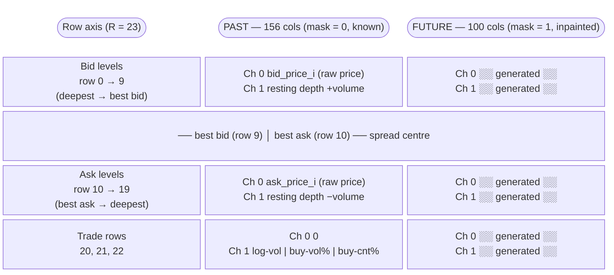
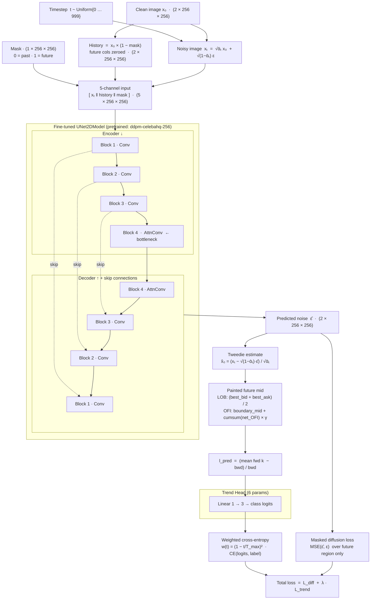
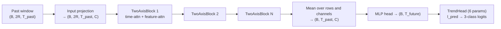

# Penny

Penny explores three complementary approaches for **price-direction forecasting on cryptocurrency limit order books (LOBs)**. All approaches share the same raw data, DeepLOB trend labels, and 70/15/15 temporal split; they differ in what they model and how:

| Approach | Package | What it does |
|---|---|---|
| **Painting** | `src/painting/` | Treats the LOB window as a 2D image and *inpaints* the future region using a fine-tuned diffusion UNet (RePaint + DDIM). Generates probabilistic futures, reconstructs the mid-price, and votes on direction. |
| **CSDI** | `src/csdi/` | Two-axis transformer (feature-axis + time-axis) that directly forecasts future mid-price returns from the multivariate LOB row stream. No diffusion, deterministic inference. |
| **TimesFM** | `src/timesfm/` | Univariate forecaster: a fine-tuned TimesFM prior blended with a trainable residual transformer. Operates only on the mid-price series. Falls back to the residual-only transformer if the TimesFM package is unavailable. |

Trained on 10-second order-book snapshots of **BTC/IRT from Nobitex** (Iranian crypto exchange).

---

## Table of Contents

1. [Data](#1-data)
2. [Feature Extraction](#2-feature-extraction)
3. [Image Construction (Painting only)](#3-image-construction-painting-only)
4. [Normalization](#4-normalization)
5. [Dataset Splitting and Windowing](#5-dataset-splitting-and-windowing)
6. [DeepLOB Trend Labels](#6-deeplob-trend-labels)
7. [OFI Mid-Price Reconstruction (Painting / OFI mode)](#7-ofi-mid-price-reconstruction-painting--ofi-mode)
8. [Model Architectures](#8-model-architectures)
9. [Diffusion Process (Painting only)](#9-diffusion-process-painting-only)
10. [Training](#10-training)
11. [Validation](#11-validation)
12. [Test Evaluation](#12-test-evaluation)
13. [Setup and Usage](#13-setup-and-usage)
14. [SLURM](#14-slurm)
15. [Configuration](#15-configuration)
16. [Project Structure](#16-project-structure)

---

## 1. Data

Raw market data for each exchange is stored under `data/` and tracked by DVC (not Git).

| Exchange | Pairs |
|---|---|
| Nobitex | BTCIRT, USDTIRT |
| Bitpin | BTC_IRT, USDT_IRT |
| Wallex | BTCTMN, USDTTMN |
| Tabdeal | BTCIRT, USDTIRT |
| Ramzinex | BTC_IRT, USDT_IRT |

IRT and TMN both denote Iranian Toman (different naming conventions per exchange).

**Order-book snapshots** (`*_orderbook.csv`) contain a timestamp and up to 20 bid/ask price-volume levels per snapshot captured every 10 seconds. **Trade ticks** (`*_trades.csv`) contain each individual trade's timestamp, price, volume, and direction (buy/sell).

The default training target is **BTCIRT on Nobitex**.

---

## 2. Feature Extraction

The painting and CSDI packages both operate on a **multivariate row stream** of shape `(N, R, 2)`, where N is the number of snapshots, R = 2n + 3 is the number of rows (n = 10 LOB levels per side + 3 trade rows), and 2 is the channel count.

TimesFM is univariate and only uses the **mid-price series** `(best_bid + best_ask) / 2`.

### Row layout

Rows are indexed 0 to R−1 with the tightest spread at the centre:

- Rows **0 to n−1**: bid levels, deepest at row 0, best bid at row **n−1**.
- Rows **n to 2n−1**: ask levels, best ask at row **n**, deepest at row **2n−1**.
- Rows **2n, 2n+1, 2n+2**: trade-feature rows (channel 1 only; channel 0 = 0).

### Channel 0 — flow (`feature_mode` switch)

**OFI mode (default):** per-level Cont Order Flow Imbalance (Cont et al. 2013).

- **Bid level i (`bofi`):** if the bid price improved (moved up) → +new_volume; if unchanged → +Δvolume; if worsened → −previous_volume.  Positive = bid liquidity added.
- **Ask level i (`aofi`):** mirror logic, stored buy-positive (tightening ask = buying pressure).
- **Net best-level OFI** = `aofi_best − bofi_best` (used for mid-price reconstruction and the γ fit).
- The first snapshot has no predecessor: OFI is set to zero.

**LOB mode:** raw bid/ask prices. Row rb carries `bid_price_i`, row ra carries `ask_price_i`. No mid subtraction.

### Channel 1 — state

Resting signed depth: +volume for bids, −volume for asks. For trade rows, channel 1 carries:

1. `log(1 + total_volume)` of all trades in the preceding `snapshot_interval_sec` seconds.
2. Buy-volume ratio (fraction of volume that was buyer-initiated; 0.5 if no trades).
3. Buy-count ratio (fraction of trade count that was buyer-initiated; 0.5 if no trades).

---

## 3. Image Construction (Painting only)

### From row stream to image

For each sliding window of T_total consecutive snapshots, the row stream slice of shape `(T_total, R, 2)` is transposed to `(R, T_total, 2)`. The first T_past columns are the observed past; the last T_future columns are the inpainted target.

Default: **T_past = 156** (≈ 26 min), **T_future = 100** (≈ 17 min), **T_total = 256** (≈ 43 min).

In OFI mode the channel-0 value at column 0 is forced to zero (no predecessor at the window boundary).

#### OFI mode — feature image layout



#### LOB mode — feature image layout



### Square padding

The UNet requires a square input. Since R = 23 ≪ T_total = 256, each row is repeated along the height axis (round-robin, so some rows get one extra repeat) until the padded height reaches `padded_size = 256`. The mapping from original row index to padded slice is stored as `level_starts`.

Final image tensor: `(2, 256, 256)` — two channels, height 256, width 256.

### Inpainting mask

A binary mask `(1, 256, 256)` marks the future region: all columns ≥ T_past are set to 1 (generate), all columns < T_past are set to 0 (re-paste known data). The mask is constant across windows.

---

## 4. Normalization

Used by painting and CSDI (TimesFM operates in window-relative returns and needs no normalizer).

A `RollingNormalizer` fits per-row, per-channel z-score statistics from the **last `norm_window_snapshots` rows of the training split** (default 8 640 ≈ 1 day), then freezes them:

1. Compute `mean` and `std` per (row, channel) over the fitting window.
2. Z-score: `z = (x − mean) / std`.
3. Clip at the 95th percentile of |z| observed over the full training set.
4. Cast to float32.

No training statistics touch validation or test data — no look-ahead leakage. The normalizer is saved in every checkpoint so inference can restore it without re-processing the training data.

---

## 5. Dataset Splitting and Windowing

### Fraction-based temporal split

Data is divided by snapshot index with **no random shuffling**. The first 70% of snapshots go to training, the next 15% to validation, and the last 15% to test. Split boundaries fall at exact index positions, so the ordering of real market time is always preserved.

### Sliding windows with stride

Within each split, windows of length T_total are extracted every `stride` snapshots (default 30 = 5 minutes at 10 s). Consecutive windows overlap heavily (T_total − stride = 226 shared snapshots at the defaults), multiplying the number of training examples from ≈ 34 per day (non-overlapping) to ≈ 280 per day.

**Day-boundary skipping:** any window whose first and last snapshot fall on different calendar days is discarded. This prevents the model from seeing a past region that spans midnight while the future spans the next day.

---

## 6. DeepLOB Trend Labels

Following Ntakaris et al. (2018), the trend label is derived from the **smoothed mid-price** on both sides of the window boundary.

### Trend ratio

```
bwd = mean(mid[T_past − k : T_past])    # mean of last k past mids
fwd = mean(mid[T_past : T_past + k])    # mean of first k future mids
l   = (fwd − bwd) / bwd                 # fractional change
```

Default `label_k = 10` → 100-second smoothing on each side.

### Class thresholding

| Label | Condition | Class |
|---|---|---|
| Up | l > alpha | 2 |
| Stationary | \|l\| ≤ alpha | 1 |
| Down | l < −alpha | 0 |

### Alpha calibration

`alpha` is calibrated on training windows to produce approximately equal class frequencies (one-third each). It is set to the **33.3rd percentile of |l|** over all training windows. Alpha is frozen after fitting and applied unchanged to validation, test, and inference.

Setting `label_alpha = -1` in the config triggers auto-calibration (recommended). Any positive value overrides calibration.

---

## 7. OFI Mid-Price Reconstruction (Painting / OFI mode)

In OFI mode, channel 0 carries flow quantities. The future mid-price series must be **reconstructed** from the generated OFI values for the trend label and evaluation metrics.

**γ fitting:** OLS regression (through the origin) on the training split between Δmid and net best-level OFI (`aofi_best − bofi_best`). The slope γ converts net OFI to IRT of mid-price change. γ is frozen after training and saved in the checkpoint.

**Reconstruction:**

```
mid[T_past + t] = mid[T_past] + γ · cumsum(net_ofi[T_past : T_past + t + 1])
```

The anchor is the real mid-price at the window boundary, so reconstruction is tied to observed reality. In LOB mode, the price channel is read directly and this step is skipped.

---

## 8. Model Architectures

### Painting: Fine-tuned pretrained UNet

The backbone is a `UNet2DModel` from HuggingFace Diffusers loaded from a publicly available pretrained checkpoint (`google/ddpm-celebahq-256`). The pretrained weights provide a strong initialization for the convolutional encoder-decoder structure. Input/output channels are adapted (3→5 in, 3→2 out) using `ignore_mismatched_sizes=True` — the first and last convolutional layers are re-initialized while all inner layers retain their pretrained weights.

**UNet input (5 channels):**

| Channels | Content |
|---|---|
| 0–1 | Noisy image xₜ (2 ch) |
| 2–3 | History = x₀ × (1 − mask) — past known, future zeroed (2 ch) |
| 4 | Inpainting mask (1 ch) |

**UNet output (2 channels):** predicted noise ε̂ at the same spatial resolution.

The UNet is co-trained with a **TrendHead** — a single linear layer (6 parameters) mapping the scalar trend ratio `l_pred` to 3-class logits.



---

### CSDI: Two-Axis Transformer

CSDI (Tashiro et al. 2021) interleaves a **time-axis transformer** (captures temporal patterns across T_past steps) with a **feature-axis transformer** (captures cross-level correlations across 2R feature rows). The model is a deterministic encoder — no diffusion, no sampling at inference.

**Input:** `(B, 2R, T_past)` — all channels and LOB rows over the past window, normalized.  
**Output:** `(B, T_future)` — predicted future mid-price returns relative to the window boundary.

Each `TwoAxisBlock` applies time-axis multi-head attention → feature-axis multi-head attention → feed-forward network with residual connections and layer normalization. CSDI-specific hyperparameters: `csdi_channels`, `csdi_layers`, `csdi_heads`, `csdi_diff_emb`, `csdi_time_emb`, `csdi_feature_emb`.



---

### TimesFM: Pretrained Univariate Forecaster

**Input:** past mid-price series `(B, T_past)`.  
**Output:** `(B, T_future)` future mid-price returns.

The model has two components that are blended:

1. **TimesFM prior** — `google/timesfm-2.0-500m-pytorch`, a 500 M-parameter foundation model pre-trained on a large corpus of time series. If the `timesfm` package is unavailable, this component returns zeros (the residual trains from scratch).
2. **Residual transformer** — a lightweight trainable transformer always present, regardless of TimesFM availability. It learns the residual between the prior's forecast and the true future.

The blend weight is a single learned scalar: `output = prior × blend + residual`.

The model is entirely univariate — it does not ingest LOB rows or OFI features. `feature_mode` is recorded in the config for logging parity with the other approaches but has no effect on the mid series.

---

## 9. Diffusion Process (Painting only)

### Forward process (DDPM)

Linear noise schedule from `β₁ = 0.0001` to `β₁₀₀₀ = 0.02` over T_max = 1000 steps. The cumulative product `ᾱₜ = ∏(1 − βᵢ)` governs the forward diffusion:

```
xₜ = √ᾱₜ · x₀ + √(1 − ᾱₜ) · ε,    ε ~ N(0, I)
```

At t = 0 the image is almost clean; at t = T_max it is pure noise.

### Reverse process — DDIM (inference)

50 deterministic DDIM steps (linearly spaced from T_max−1 to 0). At each step the UNet predicts ε̂, the Tweedie formula recovers x̂₀, and the DDIM update steps to the previous timestep (η = 0):

```
x̂₀ = (xₜ − √(1 − ᾱₜ) · ε̂) / √ᾱₜ
x_{t_prev} = √ᾱ_{t_prev} · x̂₀ + √(1 − ᾱ_{t_prev}) · ε̂
```

50 DDIM steps match the quality of 1000 DDPM steps at ≈ 20× lower cost.

### RePaint inpainting

At every reverse step, RePaint enforces the known-region constraint by re-pasting the real past columns with the noise level appropriate for t_prev:

```
known_noised = √ᾱ_{t_prev} · x₀_past + √(1 − ᾱ_{t_prev}) · ε_new
x_{t_prev}  = mask · ddim_step + (1 − mask) · known_noised
```

mask = 1 marks the future (generated), mask = 0 marks the past (always re-pasted from real data). This keeps the generated future sharply conditioned on the observed market history.

---

## 10. Training

### Painting

**Masked diffusion loss:**

```
L_diff = (1 / |future pixels|) · Σ_{future} (ε̂ − ε)²
```

Only the future region (mask = 1) contributes to the loss. The UNet is not penalized for noise predictions in the known past, which is re-pasted at inference anyway.

**Trend loss:**

After predicting ε̂, the Tweedie formula recovers x̂₀. The future mid-price is reconstructed from x̂₀ (price channel for LOB, OFI integration for OFI mode), and the trend ratio is computed from the reconstructed series. The trend head maps `l_pred` to 3-class logits; cross-entropy is weighted by `w(t) = (1 − t / T_max)²` so that the gradient is negligible when the UNet has almost no signal (large t near pure noise).

**Combined loss:** `L = L_diff + λ · L_trend` with `λ = 0.5`.

### CSDI and TimesFM

**Price loss:** `L_price = MSE(pred_returns, target_returns)`, where `target_returns = true_mid[T_past:] / boundary − 1`.

**Trend loss:** same TrendHead + cross-entropy; `l_pred` is derived directly from the predicted future mid-price.

**Combined loss:** `L = L_price + λ · L_trend` with `λ = 0.5`.

### Optimizer and schedule (all approaches)

**AdamW** with peak learning rate from config and weight decay 10⁻⁴. Gradients clipped to L2 norm 1.0. Schedule: linear warmup for `warmup_steps = 200` gradient steps, then cosine decay to 0.

---

## 11. Validation

**Early stopping metric:** masked diffusion loss (painting) or price MSE (CSDI/TimesFM) on the full validation set with dropout disabled. The best checkpoint is saved and early stopping triggers after `patience` epochs without improvement.

**Label accuracy (monitoring only):** for painting, a random subset of `val_eval_windows = 50` windows is inpainted `n_samples = 20` times each epoch; the modal label is compared to ground truth. For CSDI/TimesFM, label accuracy is computed over the full validation set deterministically. This accuracy is logged each epoch but does **not** influence checkpointing.

---

## 12. Test Evaluation

After training, the best checkpoint is reloaded and evaluated on the held-out test split. Painting samples `n_samples = 20` generated futures per test window; CSDI and TimesFM produce a single deterministic prediction.

| Metric | Painting | CSDI | TimesFM |
|---|---|---|---|
| **Accuracy** | modal label vs. ground truth | predicted label vs. ground truth | predicted label vs. ground truth |
| **Macro F1** | unweighted mean of per-class F1 | same | same |
| **Confusion matrix** | 3×3 true vs. predicted | same | same |
| **Trend-ratio Pearson r** | mean predicted l vs. true l | same | same |
| **Mid-price MAE** | mean reconstructed mid vs. real mid over first k steps (IRT) | same | same |
| **Spread Wasserstein** | W₁ between predicted and real spread distributions — **LOB only** | N/A | N/A |

Random baseline: ≈ 33.3% accuracy, ≈ 0.333 macro F1.

---

## 13. Setup and Usage

### Install

```bash
# CUDA 12.6  (V100, RTX 30xx/40xx)
uv sync --extra cu126

# CUDA 12.8  (A100, H100)
uv sync --extra cu128

# CUDA 13.0  (Blackwell: RTX 50xx, B100)
uv sync --extra cu130

# CPU-only
uv sync --extra cpu

# Apple Silicon (MPS)
uv sync --extra mps

# Optional: enable the TimesFM pretrained prior
uv sync --extra timesfm
```

### Data

```bash
# Pull raw data from the Cloudflare R2 DVC remote
uv run dvc pull
```

### Training

```bash
# Painting (pretrained UNet, OFI mode)
uv run python -m painting.train configs/painting/ofi.json

# Painting (pretrained UNet, LOB mode)
uv run python -m painting.train configs/painting/lob.json

# CSDI (multivariate, OFI mode)
uv run python -m csdi.train configs/csdi/ofi.json

# CSDI (multivariate, LOB mode)
uv run python -m csdi.train configs/csdi/lob.json

# TimesFM (univariate, OFI config — feature_mode is recorded only)
uv run python -m timesfm.train configs/timesfm/ofi.json

# TimesFM (univariate, LOB config)
uv run python -m timesfm.train configs/timesfm/lob.json
```

Checkpoints are saved under `checkpoints/<approach>_<mode>_<timestamp>/best.pt`.

### Inference

```bash
# Painting — generates n_samples probabilistic futures and votes on direction
uv run python -m painting.infer \
  --checkpoint checkpoints/painting_pretrained_ofi_20260101_120000 \
  --orderbook data/nobitex_data/BTCIRT_orderbook.csv \
  [--trades data/nobitex_data/BTCIRT_trades.csv] \
  [--n-samples 20] \
  [--device cuda]

# CSDI — deterministic inference
uv run python -m csdi.infer \
  --checkpoint checkpoints/csdi_ofi_20260101_120000 \
  --orderbook data/nobitex_data/BTCIRT_orderbook.csv \
  [--trades ...]

# TimesFM — deterministic inference
uv run python -m timesfm.infer \
  --checkpoint checkpoints/timesfm_ofi_20260101_120000 \
  --orderbook data/nobitex_data/BTCIRT_orderbook.csv
```

---

## 14. SLURM

All SLURM scripts live under `slurm/`. Adjust `--partition`, `--time`, and `--mem` to your cluster's naming conventions. Each script reads an optional `CONFIG` environment variable so you can override the config path at submission time without editing the script.

### Submit a single job

```bash
# Painting — OFI mode
sbatch slurm/painting_ofi.slurm

# Painting — LOB mode
sbatch slurm/painting_lob.slurm

# CSDI — OFI mode
sbatch slurm/csdi_ofi.slurm

# CSDI — LOB mode
sbatch slurm/csdi_lob.slurm

# TimesFM — OFI config
sbatch slurm/timesfm_ofi.slurm

# TimesFM — LOB config
sbatch slurm/timesfm_lob.slurm
```

### Override config at submission

```bash
CONFIG=configs/csdi/lob.json sbatch slurm/csdi_ofi.slurm
```

### Submit all six experiments at once

```bash
for script in slurm/*.slurm; do sbatch "$script"; done
```

### Monitor jobs

```bash
squeue -u "$USER"          # list your running jobs
scancel <jobid>            # cancel a specific job
seff <jobid>               # GPU/CPU/memory efficiency report after job ends
```

### Resource hints

| Approach | GPU VRAM | System RAM | Typical wall time |
|---|---|---|---|
| Painting (batch=4) | ≥ 16 GB | 32 GB | 8–12 h (50 epochs) |
| CSDI (batch=8) | ≥ 8 GB | 16 GB | 3–6 h (50 epochs) |
| TimesFM (batch=16) | ≥ 16 GB (prior) | 24 GB | 5–8 h (80 epochs) |

If the TimesFM prior does not fit in VRAM, set `timesfm_pretrained: false` in the config to use the residual transformer only.

### Environment variables

| Variable | Default | Description |
|---|---|---|
| `CONFIG` | approach-specific | Path to the JSON config file |
| `VENV_PATH` | (unset) | If set, `$VENV_PATH/bin/activate` is sourced before running. Set when using a virtualenv instead of the system uv. |

---

## 15. Configuration

All settings live in JSON files under `configs/<approach>/`. Fields common across all approaches:

| Field | Default | Description |
|---|---|---|
| `feature_mode` | `"ofi"` | `"ofi"` (Cont OFI) or `"lob"` (raw prices). TimesFM ignores this for features; it is logged only. |
| `exchange` | `"nobitex"` | Exchange name, used for data path construction |
| `pair` | `"BTCIRT"` | Trading pair |
| `n_levels` | `10` | LOB depth levels per side |
| `snapshot_interval_sec` | `10` | Seconds between order-book snapshots |
| `T_past` | `156` | Observed past window length (≈ 26 min at 10 s) |
| `T_future` | `100` | Future window to forecast/inpaint (≈ 17 min at 10 s) |
| `T_total` | `256` | Total window length = T_past + T_future |
| `train_frac` | `0.70` | Fraction of snapshots for training |
| `val_frac` | `0.15` | Fraction of snapshots for validation (remainder = test) |
| `stride` | `30` | Snapshots between window starts (5 min at 10 s) |
| `norm_window_snapshots` | `8640` | Rows used to fit the normalizer (≈ 1 day) |
| `clip_percentile` | `0.95` | Outlier clip quantile of \|z\| |
| `n_trade_rows` | `3` | Number of trade-feature rows |
| `label_k` | `10` | Smoothing half-window for trend ratio (100 s each side) |
| `label_alpha` | `-1` | Trend threshold; −1 = auto-calibrate for balanced thirds |
| `lr` | varies | Peak learning rate (AdamW) |
| `weight_decay` | `1e-4` | AdamW weight decay |
| `warmup_steps` | `200` | Gradient steps for linear warmup |
| `grad_clip` | `1.0` | Gradient L2 norm clip |
| `batch_size` | varies | Training batch size |
| `epochs` | varies | Maximum training epochs |
| `patience` | `10` | Early stopping patience |
| `lambda_trend` | `0.5` | Weight of trend loss vs. primary loss |
| `device` | `"cuda"` | `"cuda"`, `"mps"`, or `"cpu"` |
| `cache_dir` | `"data/cache"` | Directory for `.npz` dataset cache |
| `checkpoint_root` | `"checkpoints"` | Root directory for checkpoints |

**Painting-specific:**

| Field | Default | Description |
|---|---|---|
| `pretrained_model_id` | `"google/ddpm-celebahq-256"` | HuggingFace model ID for the pretrained UNet |
| `padded_size` | `256` | Square padding size for UNet input |
| `beta_start` | `0.0001` | First β in linear DDPM schedule |
| `beta_end` | `0.02` | Last β in linear DDPM schedule |
| `T_max` | `1000` | Total diffusion timesteps |
| `ddim_steps` | `50` | DDIM reverse steps at evaluation |
| `dropout` | `0.1` | Dropout rate inside UNet blocks |
| `n_samples` | `20` | Diffusion samples per window at evaluation |
| `val_eval_windows` | `50` | Validation windows sampled for label accuracy each epoch |

**CSDI-specific:**

| Field | Default | Description |
|---|---|---|
| `csdi_channels` | `64` | Internal channel width of each transformer block |
| `csdi_layers` | `4` | Number of TwoAxisBlock layers |
| `csdi_heads` | `8` | Attention heads (time-axis and feature-axis) |
| `csdi_diff_emb` | `128` | Diffusion-step embedding dimension (unused in deterministic mode; kept for parity) |
| `csdi_time_emb` | `128` | Time positional embedding dimension |
| `csdi_feature_emb` | `16` | Feature row embedding dimension |

**TimesFM-specific:**

| Field | Default | Description |
|---|---|---|
| `timesfm_pretrained` | `true` | Load the TimesFM pretrained prior (requires `timesfm` extra) |
| `timesfm_repo` | `"google/timesfm-2.0-500m-pytorch"` | HuggingFace repo for the prior |
| `timesfm_hidden` | `256` | Hidden size of the residual transformer |
| `timesfm_heads` | `8` | Attention heads in the residual transformer |
| `timesfm_layers` | `4` | Layers in the residual transformer |

---

## 16. Project Structure

```
configs/
  painting/
    ofi.json             Pretrained UNet, OFI feature mode
    lob.json             Pretrained UNet, LOB feature mode
  csdi/
    ofi.json             CSDI multivariate, OFI mode
    lob.json             CSDI multivariate, LOB mode
  timesfm/
    ofi.json             TimesFM univariate, OFI config
    lob.json             TimesFM univariate, LOB config
data/                    Raw CSV data (DVC-tracked, not in Git)
  nobitex_data/
    BTCIRT_orderbook.csv
    BTCIRT_trades.csv
  ...
slurm/
  painting_ofi.slurm
  painting_lob.slurm
  csdi_ofi.slurm
  csdi_lob.slurm
  timesfm_ofi.slurm
  timesfm_lob.slurm
src/
  painting/
    labels.py            DeepLOB trend ratio, alpha calibration
    features.py          OFI/depth/trade row builder, padding, mask, RollingNormalizer
    diffusion.py         DDPM schedule, q_sample, DDIM step, RePaint step + sampler
    model.py             Fine-tuned UNetInpaintModel, TrendHead, mid reconstruction
    dataset.py           Fraction split, sliding windows, gamma + alpha fit, cache
    train.py             Train entry point: python -m painting.train <config>
    evaluate.py          Test metrics (6 metrics incl. spread Wasserstein for LOB)
    infer.py             RePaint inference: predict() → signal dict
  csdi/
    labels.py            Same DeepLOB labels
    features.py          Same row-stream builder (no padding/mask)
    dataset.py           ForecastDataset: (2R, T_past) tensors
    model.py             CSDIForecastModel: two-axis transformer
    train.py             Train entry point: python -m csdi.train <config>
    evaluate.py          Test metrics (5 metrics)
    infer.py             Deterministic forecast → signal dict
  timesfm/
    labels.py            Same DeepLOB labels
    features.py          load_orderbook, mid_series (univariate only)
    dataset.py           ForecastDataset: mid series tensors
    model.py             TimesFMForecastModel: pretrained prior + residual
    train.py             Train entry point: python -m timesfm.train <config>
    evaluate.py          Test metrics (5 metrics)
    infer.py             Deterministic forecast → signal dict
```

---

## References

- Backhouse et al., *Painting the Market: A Generative Diffusion Model for LOB Simulation*, arXiv:2509.05107v1, 2025.
- Tashiro et al., *CSDI: Conditional Score-based Diffusion Models for Probabilistic Time Series Imputation*, NeurIPS 2021.
- Das et al., *A Decoder-Only Foundation Model for Time-Series Forecasting (TimesFM)*, ICML 2024.
- Ntakaris et al., *Benchmark Dataset for Mid-Price Forecasting of Limit Order Book Data with Machine Learning Methods*, Journal of Forecasting, 2018.
- Cont, Kukanov, Stoikov, *The Price Impact of Order Book Events*, Journal of Financial Econometrics, 2014.
- Lugmayr et al., *RePaint: Inpainting using Denoising Diffusion Probabilistic Models*, CVPR 2022.
- Song et al., *Denoising Diffusion Implicit Models*, ICLR 2021.
- Ho et al., *Denoising Diffusion Probabilistic Models*, NeurIPS 2020.
