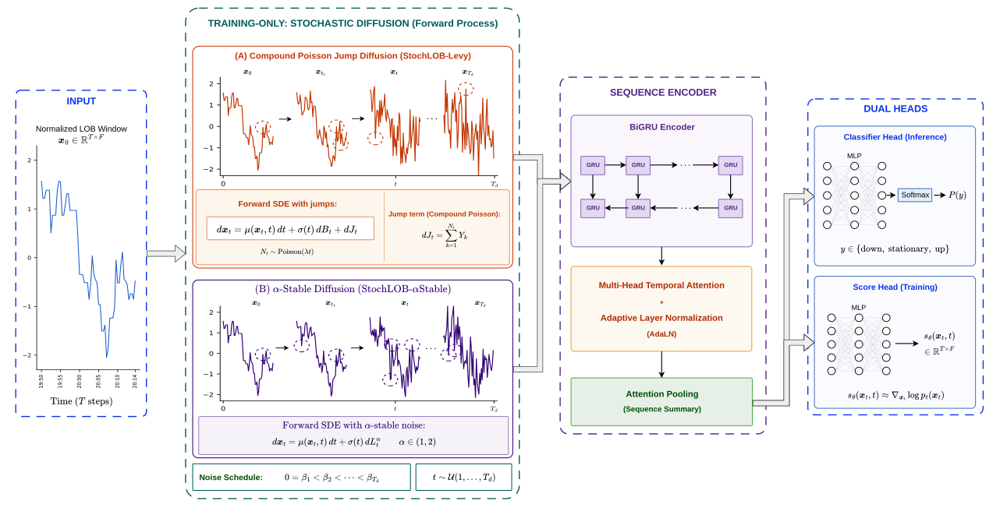

# Penny

**This repository trains diffusion models that are, at the same time, discriminative and
generative** — a single backbone learns to *denoise* a limit-order-book (LOB) window
(the generative objective) **and** to *classify* its short-term price direction (the
discriminative objective), sharing one representation. The generative diffusion task
regularises the encoder so the features the classifier reuses are richer than plain
supervised training would produce; at inference only the cheap classification path
runs.

The project forecasts a 3-class LOB **trend** (`down / flat / up`) on crypto data from
**Binance** (USDT pairs) and **Coinbase** (Iranian Toman pairs), and ships a suite of
established **discriminative baselines** alongside the joint models for comparison.

- **Joint generative–discriminative models:** JointDiT (Diffusion Transformer, with
  five training objectives — DDPM, consistency, t-EDM, drift, Lévy — plus a two-phase
  probe), JumpGateLOB (jump-diffusion score matching + noise-consistent classification,
  feature-only inference), AlphaStableLOB (the same trunk with a genuine α-stable,
  power-law-tailed forward process), and GaussGateLOB (the same trunk again with plain
  Gaussian noise and the closed-form score — the control the two heavy-tailed kernels
  are measured against).
- **Discriminative baselines:** DeepLOB, CTABL, BiN-CTABL, TLOB, DLA, Axial-LOB.

See **[docs/models](docs/models/README.md)** for every model, **[docs/data](docs/data/README.md)**
for the data pipeline, and **[docs/xai](docs/xai/README.md)** for the explainability layer.

## Architecture and workflow



StochLOB uses one shared LOB sequence encoder with two training roles. A normalized
LOB window first follows the clean classifier path: feature normalization, temporal
sequence encoding, attention-based aggregation, and a three-class trend head for
`down / flat / up` prediction. During training, a second branch corrupts the same
window with noise and trains a score head to denoise it. The Levy variant uses
compound-Poisson jump corruption; the alpha-stable variant uses clipped heavy-tailed
scale-mixture corruption; the Gaussian variant uses plain Brownian corruption with the
closed-form score, as the control for the other two. At inference time the corruption
sampler and score head are disabled, so prediction is a single clean-window forward pass through
the classifier.

## Setup

Requirements: **Python 3.10** and [`uv`](https://docs.astral.sh/uv/).

Dependencies (notably PyTorch) are installed via a hardware **extra** — pick the one
matching your machine:

```bash
uv sync --extra cpu      # CPU-only (local dev / non-GPU nodes)
uv sync --extra mps      # Apple Silicon (Metal)
uv sync --extra cu118    # CUDA 11.8  (Pascal/Volta/Turing)
uv sync --extra cu126    # CUDA 12.6  (Turing/Ampere/Ada)
uv sync --extra cu128    # CUDA 12.8
uv sync --extra cu130    # CUDA 13.0  (Blackwell; PyTorch 2.11 default)
```

On SLURM the extra is auto-detected from the GPU compute capability (see
[Running on SLURM](#running-on-slurm)).

## Get the data (DVC)

Raw and resampled market data are **not** in git — they are tracked with
[DVC](https://dvc.org) on an S3-compatible **Cloudflare R2** bucket (`penny`).

```bash
uv run dvc pull      # download data/ from the remote
uv run dvc push      # upload new/changed data
```

> **DVC credentials:** the R2 access keys are **not** stored in the repo — they belong
> in `.dvc/config.local` (git-ignored). **Contact the team** to obtain the
> credentials, drop them into `.dvc/config.local`, then run `uv run dvc pull`.

If you have raw exchange dumps but no resampled parquet, regenerate them:

```bash
uv run python scripts/resample_binance.py --interval 10 --levels 10
uv run python scripts/resample_coinbase.py --levels 20
```

Details: [docs/data](docs/data/README.md).

## Train a model

Every run is driven by a single JSON config under `configs/`. The invocation is
`python -m crypto.train_<model> <config.json>`:

```bash
# discriminative baseline
uv run python -m crypto.train_deeplob   configs/crypto/binance/deeplob/btcusdt_ofi.json

# joint generative–discriminative (base DDPM objective)
uv run python -m crypto.train_jointdit  configs/crypto/coinbase/jointdit/btcirt_ofi_k10.json

# JointDiT alternative training objectives (same backbone)
uv run python -m crypto.train_jointdit_cm    configs/crypto/coinbase/jointdit_cm/btcirt_ofi_k10.json
uv run python -m crypto.train_jointdit_tedm  configs/crypto/coinbase/jointdit_tedm/btcirt_ofi_k10.json --nu 5
uv run python -m crypto.train_jointdit_drift configs/crypto/coinbase/jointdit_drift/btcirt_ofi_k10.json
uv run python -m crypto.train_jointdit_levy  configs/crypto/coinbase/jointditlevy/btcirt_ofi_k10.json

# Lévy jump-aware joint model (feature-only inference)
uv run python -m crypto.train_jumpgatelob    configs/crypto/coinbase/jumpgatelob/btcirt_ofi_k10.json

# α-stable joint model (heavy, power-law-tailed Lévy noise + generalized score matching)
uv run python -m crypto.train_alphastablelob configs/crypto/coinbase/alphastablelob/btcirt_ofi_k10.json

# Gaussian control for the two above (same trunk/objective, closed-form score)
uv run python -m crypto.train_gaussgatelob   configs/crypto/coinbase/gaussgatelob/btcirt_ofi_k10.json
```

Each run builds/loads the feature cache, trains with early stopping, restores the best
checkpoint, and logs test metrics. Outputs (`best.pt`, `config.json`,
`training_log.json`, `train.log`) go to a timestamped folder under the config's
`checkpoint_dir`.

Configs are organised as `configs/crypto/{exchange}/{model}/{symbol}_{mode}_{k}.json`,
where `mode ∈ {ofi, lob}` is the feature representation and `k` is the label horizon.

### Seed sweeps (mean ± std)

Every `train_*.py` accepts `--seeds`, which trains the same config once per seed and
reports test accuracy and macro-F1 as mean ± std across seeds:

```bash
uv run python -m crypto.train_deeplob configs/crypto/coinbase/deeplob/btcirt_ofi_k10.json --seeds 0 1 2
uv run python -m crypto.train_deeplob configs/crypto/coinbase/deeplob/btcirt_ofi_k10.json --seeds 0,1,2
```

Seed precedence is `--seeds` > `$PENNY_SEED` > `config["seeds"]` > `config["seed"]`, so
a single-seed run behaves exactly as before. With more than one seed each run gets its
own `…_seed{n}` folder and the sweep writes `…_seed_summary.json` (per-seed values plus
mean / std / sem / min / max) beside them. Collect every sweep into one table with:

```bash
uv run python scripts/seed_report.py checkpoints --csv outputs/seed_report.csv
```

That spread is training (seed) variance on a fixed test set — not a confidence interval
for the metric, and not a model-vs-model test; use `scripts/stochlob_significance.py`
for the latter, which accounts for the dependence between overlapping LOB windows.

## Running on SLURM

Batch scripts under `slurm/` submit any config to a GPU node and auto-select the
CUDA/CPU extra from the detected GPU:

```bash
sbatch slurm/coinbase/btcirt/k10/jointdit_ofi.slurm
CONFIG=configs/crypto/binance/deeplob/btcusdt_lob.json sbatch slurm/binance/btcusdt/k10/deeplob_lob.slurm
```

Layout mirrors the configs: `slurm/{exchange}/{symbol}/{k}/{model}_{mode}.slurm`
(per-symbol horizon sweeps) plus flat `slurm/{exchange}/{symbol}/` folders where a
symbol has no horizon sweep.

## Documentation

| Area | Start here |
|------|-----------|
| **Data** — exchanges, resampling, features, labels, windowing, normalisation | [docs/data/README.md](docs/data/README.md) |
| **Models** — every architecture + training procedure (with diagrams) | [docs/models/README.md](docs/models/README.md) |
| **XAI** — attribution, probes, CKA, attention-vs-IG agreement (with diagrams) | [docs/xai/README.md](docs/xai/README.md) |

Per-topic files:

- Data: [binance](docs/data/binance.md) · [coinbase](docs/data/coinbase.md) ·
  [features](docs/data/features.md) · [labels](docs/data/labels.md) ·
  [windows & normalisation](docs/data/windows-and-normalization.md)
- Models: [DeepLOB](docs/models/deeplob.md) · [CTABL](docs/models/ctabl.md) ·
  [BiN-CTABL](docs/models/binctabl.md) · [TLOB](docs/models/tlob.md) ·
  [DLA](docs/models/dla.md) · [Axial-LOB](docs/models/axiallob.md) ·
  [JointDiT](docs/models/jointdit.md) · [JumpGateLOB](docs/models/jumpgatelob.md) ·
  [AlphaStableLOB](docs/models/alphastablelob.md) ·
  [GaussGateLOB](docs/models/gaussgatelob.md) · [OFSAT-NET](docs/models/ofsatnet.md)
- XAI: [attribution](docs/xai/attribution.md) · [faithfulness](docs/xai/faithfulness.md) ·
  [probes](docs/xai/probes.md) · [CKA](docs/xai/cka.md) ·
  [agreement](docs/xai/agreement.md) · [gate sweep](docs/xai/gate-sweep.md) ·
  [attention readouts](docs/xai/attention-readouts.md) · [running the layer](docs/xai/run-all.md)

## Repository layout

```
configs/          per-model / per-symbol / per-horizon JSON configs
scripts/          resample_binance.py, resample_coinbase.py, find_alpha.py, plot_xai.py
slurm/            SLURM batch scripts mirroring configs/
src/
  crypto/         data pipeline (features, labels, dataset, loader) + train_*.py entry points
  models/         model architectures + shared diffusion machinery (ddpm, consistency, drift, probe)
  xai/            explainability layer (IG attribution, probes, CKA, agreement, gate sweep) + run_all
  levy/           Lévy jump-diffusion forward process + tabulated generalized score
  stocks/feishu/  equity (A-share) pipeline + feishu_midprice horizon sweep
  utils/          training loop helpers, evaluation, FLOPs, PCGrad
docs/             this documentation
data/             DVC-tracked (not in git)
```
