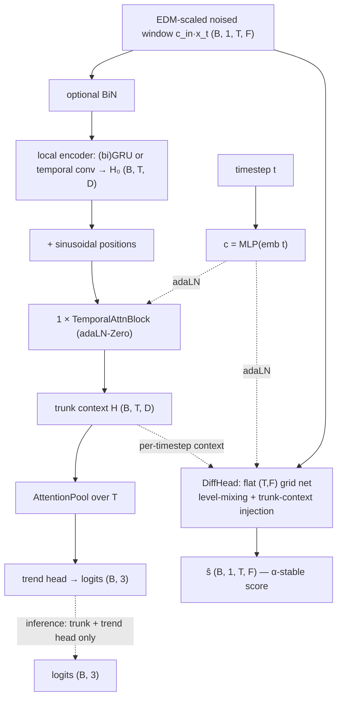

# AlphaStableLOB

A joint diffusion-classifier that reuses [JumpGateLOB](jumpgatelob.md)'s **trunk idea**
(BiN → GRU local encoder → one temporal-attention layer, feature-only inference) but
drives the generative branch with a genuine **α-stable (Lévy-stable)** forward process:
heavy, **power-law-tailed** noise (infinite variance for `α < 2`) that matches the fat
tails of high-frequency LOB returns.

Unlike the finite-variance "Lévy" jump-diffusion in [JumpGateLOB](jumpgatelob.md) (a
compound-Poisson Gaussian scale mixture, *finite* variance, exponential tails), this is
**true α-stable** noise — the `α<2` regime with genuinely divergent variance. The
Gaussian end of the same spectrum is [GaussGateLOB](gaussgatelob.md).

- **References:** α-stable diffusion / subordinated-Gaussian representation (Samorodnitsky
  & Taqqu; Kanter 1975 sampler); generalized score matching for Gaussian scale mixtures
  (Baule 2025, as used in `src/levy/`); joint diffusion (Deja et al. 2023).
- **Type:** joint generative–discriminative.
- **Source:** `src/models/alphastablelob.py` · diffusion math `src/models/alphastable.py`
- **Trainer:** `crypto.train_alphastablelob`

## The α-stable forward process (`models/alphastable.py`)

An α-stable law has no closed-form density or score — the obstacle that makes α-stable
diffusion hard. We use the classical **subordinated-Gaussian** representation, which
turns it into a Gaussian scale mixture:

```
x_t = √ᾱ_t · x₀ + √W · ε ,   ε ~ N(0, I) ,   W = σ_t² · A ,   A ~ PositiveStable(α/2)
```

- `A` is a positive (maximally-skewed) `α/2`-stable **subordinator**, sampled by
  **Kanter's (1975)** algorithm. Marginalising over `A` makes the additive noise
  genuinely symmetric-α-stable.
- `ᾱ_t` is a **cosine** schedule; `σ_t = √(1−ᾱ_t)`.
- **Sanity limit** `α → 2` ⇒ `A → 1` (the `α/2 → 1` positive stable is degenerate at 1)
  ⇒ `W = σ_t²` ⇒ ordinary **Gaussian** diffusion. (Verified: the tabulated score matches
  `−u/σ_t²` exactly at `α=2`.)

**Score by tabulation.** Because the kernel is a Gaussian scale mixture, its isotropic
score collapses to a 1-D table:

```
∇_u log q(u) = −u · h(|u|) ,   h(r) = E[ 1/W | |u| = r ]
```

`h` is precomputed per timestep by Monte-Carlo over `A` (same construction as the
finite-variance Lévy path in `src/levy/generalized_score.py`, with an α-stable
subordinator). The diffusion head is trained to **predict this score**.

**Numerical stability.** `A` is heavy-tailed, so `x_t` has huge outliers. The forward
returns an EDM-style input scale `c_in = 1/√(1+W)` that the trainer applies to the
*network input* so the trunk always sees an `O(1)` window (the score *target* is
unchanged). `A` is clipped at a high quantile `astable_clip_q` (a truncated-stable law —
still far heavier-tailed than Gaussian) to keep the MC estimate and training stable.

## Architecture


```mermaid
flowchart TD
    XT["EDM-scaled noised window c_in·x_t (B, 1, T, F)"] --> BIN["optional BiN"]
    BIN --> LOC["local encoder: (bi)GRU or temporal conv → H₀ (B, T, D)"]
    LOC --> POSA["+ sinusoidal positions"]

    T["timestep t"] --> CMLP["c = MLP(emb t)"]

    POSA --> TATT["1 × TemporalAttnBlock (adaLN-Zero)"]
    CMLP -. adaLN .-> TATT
    TATT --> H["trunk context H (B, T, D)"]

    H --> POOL["AttentionPool over T"]
    POOL --> TREND["trend head → logits (B, 3)"]

    XT --> DHEAD["DiffHead: flat (T,F) grid net<br/>level-mixing + trunk-context injection"]
    H -. per-timestep context .-> DHEAD
    CMLP -. adaLN .-> DHEAD
    DHEAD --> S["ŝ (B, 1, T, F) — α-stable score"]

    TREND -. "inference: trunk + trend head only" .-> OUT["logits (B, 3)"]
```

## Training objective

Joint, with **separate passes** so the trend head always sees the clean-window
distribution it will see at inference. Three terms — but `L_robust` is gated by
`μ_robust`, which **every shipped config sets to `0`**, so as configured the model
trains on `L_cls + λ_diff·L_score`:

```
L_cls    = CE(classify(x₀), label)                     # clean pass, t = 0
L_score  = ‖ ŝ(c_in·x_t, t) − ∇log q(x_t|x₀) ‖²        # generalized score matching
L_robust = CE(classify(c_in·x̃), label)                 # α-stable-noised low-t pass
         + robust_kl · KL( p(x̃) ‖ p(x₀).detach() )     # clean/noisy consistency
L        = L_cls + λ_diff·L_score + μ_robust·L_robust
```

The score target `−u·h(|u|)` is bounded (the score of a heavy-tailed law decays), so a
plain MSE on the score is well-behaved even though the *noise* has infinite variance.

**`L_robust`** (**off by default — `mu_robust: 0.0`**) is the same noise-consistency
term [JumpGateLOB](jumpgatelob.md) uses, here driven by **heavy-tailed** rather than
jump-diffusion noise, and configured identically (`mu_robust`, `robust_kl` carry the
Lévy model's values). `x̃` is the α-stable forward applied at a **low `t`** — the
SNR ≥ 1 region, `ᾱ_t ≥ 0.5`, so the label is still recoverable — classified at the
head's `t = 0` conditioning, because deployment never knows the noise level. CE keeps
the noisy prediction correct; the KL term pulls it toward the model's own clean
prediction. While it is off the α-stable branch regularises the trunk only *indirectly*
through the score head and the classifier never sees a heavy-tailed window; set
`mu_robust > 0` to change that.

The robust pass reuses the score pass's `c_in` scaling. Unlike the finite-variance
jump-diffusion, an α-stable draw can be enormous even at low `t` — on z-scored features
the raw low-`t` window runs several times the clean window's magnitude — and an
unscaled input would blow up the trunk; `c_in` is a single per-sample scalar, so it
changes the window's contrast, not its pattern.

Model selection and early stopping are on **trend-head macro-F1** (feature-only), not
the score loss. Each epoch also logs `noisy_val_f1` — macro-F1 on α-stable-noised
validation windows; with `mu_robust: 0.0` it is diagnostic only, and becomes the metric
`L_robust` moves once the term is enabled. `--baseline` runs `L_cls` only (no diffusion,
no robustness); `--alpha` overrides the tail index.

## I/O

- **Input** `(B, 1, T_past, n_features)`
- **Output (train)** `(ŝ, logits)`; **(inference)** `(B, 3)` logits from the clean-window
  trunk pass. The heavy-tailed diffusion is a training-time regulariser only.

## Config keys

Tail / diffusion: `astable_alpha` (stability index, `2.0` = Gaussian, smaller = heavier
tails), `T_max`, `cosine_s`, `astable_num_r`, `astable_mc`, `astable_clip_q`,
`lambda_diff`.
Robustness: `mu_robust` (weight on `L_robust`, ships at `0.0` = off), `robust_kl`
(weight on the clean/noisy KL inside it, ships at `1.0` and is inert while `mu_robust`
is 0) — same values as the Lévy model's configs.
Trunk: `astable_local` (`gru`/`conv`), `astable_gru_hidden`, `astable_gru_layers`,
`astable_bidirectional`, `astable_attn_heads`, `astable_diff_channels`,
`astable_diff_blocks`, `astable_feat_mix` (`conv`/`attn`), `astable_time_emb`,
`astable_pool_heads`, `use_bin`, `cls_dropout`, `label_smoothing`.

## Run

```bash
uv run python -m crypto.train_alphastablelob configs/crypto/coinbase/alphastablelob/btcirt_ofi_k10.json
uv run python -m crypto.train_alphastablelob ... --alpha 1.5     # heavier tails
uv run python -m crypto.train_alphastablelob ... --baseline      # plain-classifier reference
```
