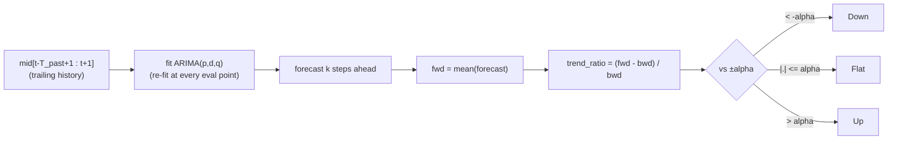

# ARIMA

A classical univariate statistical baseline: no learned weights, no shared trunk —
included purely as a sanity-check floor for the neural models.



## Procedure

At every evaluation point `t` (a walk-forward, no-lookahead point — mirrors the same
`centre = s + T_past - 1` convention as the neural datasets):

1. Fit `ARIMA(p, d, q)` on the trailing `T_past` mid-price window `mid[t-T_past+1 : t+1]`.
2. Forecast `label_k` steps ahead; take the mean of the forecast as `fwd`.
3. Compute `bwd = mean(mid[t-k:t])` (identical to `crypto/labels.py`).
4. `trend_ratio = (fwd - bwd) / bwd`, bucketed with the same `alpha` used to label the
   neural models' training data (down / flat / up), so results are directly comparable.

If the ARIMA fit fails to converge on a window, the forecast falls back to a
random-walk (last-value) prediction rather than crashing the run.

## Why it's here

A trend classifier that can't beat a linear time-series model on its own price history
isn't learning anything the market microstructure features add. ARIMA only sees the mid
price (no order-book depth, no OFI) — it is expected to be the weakest baseline, and
the gap to it quantifies how much the LOB-aware models actually gain from book/flow
features rather than price momentum alone.

## Cost note

Re-fitting per evaluation point is expensive, so evaluation points are subsampled via
`eval_stride` (defaults to `max(stride, label_k)`) rather than swept at `stride=1` like
the neural models' training windows.

## Config

`configs/crypto/nobitex/arima/btcirt_ofi_k{10,20,50,100}.json` — `arima_order` (default
`[2, 1, 2]`), `eval_stride`, plus the shared `T_past` / `label_k` / split fields.

```bash
uv run python -m crypto.train_arima configs/crypto/nobitex/arima/btcirt_ofi_k10.json
```
