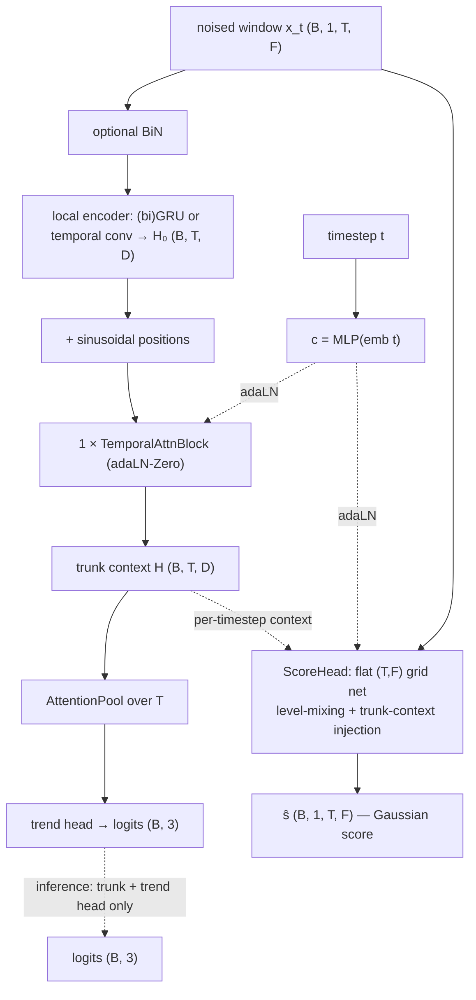

# GaussGateLOB

The **Gaussian control** for the two heavy-tailed joint models. Architecturally
identical to [JumpGateLOB](jumpgatelob.md) — same trunk, same two heads, same
parameter count — and trained with the same three-term objective, but the corruption
kernel is **plain Brownian noise** instead of a Lévy jump-diffusion. Because the
Gaussian score is available in **closed form**, the score head regresses an exact
target: no Monte-Carlo table, no tabulation error, no jump or tail hyperparameters.

That is the point of the model: holding architecture, schedule, DSM weighting and
loss structure fixed, any difference in trend accuracy against JumpGateLOB or
[AlphaStableLOB](alphastablelob.md) is attributable to the **corruption law alone**.

- **References:** denoising score matching (Vincent 2011; Song & Ermon 2019); joint
  diffusion (Deja et al. 2023); clean/noisy prediction consistency for robustness.
- **Type:** joint generative–discriminative (ablation reference).
- **Source:** `src/models/gaussgatelob.py` · forward process `src/models/gaussian.py`
- **Trainer:** `crypto.train_gaussgatelob`

## The idea

A **shared trunk** (run once per pass) feeds two heads:

- **trend head** — attention-pool over `T` → 3 logits. **Inference runs only the trunk
  + this head on the clean window** — no reverse sampling.
- **score head** — a flat `(T, F)` grid net predicting the Gaussian **score**
  `ŝ (B, 1, T, F)` (single channel; a training-time auxiliary).

The trunk is a **(bi)GRU local encoder** for order-aware per-timestep context, then
**one** DiT-style **temporal self-attention** layer, adaLN-Zero conditioned on the
timestep embedding — block-for-block the same as JumpGateLOB's. Only the config-key
prefix differs (`ggl_*` rather than `jgl_*`/`jdl_*`) so the two can be tuned
independently.

## Architecture



## The Gaussian forward process (`models/gaussian.py`)

The additive perturbation at timestep `t` is ordinary Brownian noise:

```
u = x_t − a_t·x₀ = σ_t · ε ,   ε ~ N(0, I)
∇_{x_t} log q(x_t | x₀) = −u / σ_t²
```

The other two joint models corrupt with **Gaussian scale mixtures** `u = √W·ξ` whose
mixing variance `W` is random — compound-Poisson gamma jumps in JumpGateLOB, an
α-stable subordinator in AlphaStableLOB — and whose score has no closed form, so it
must be tabulated by Monte-Carlo. Here `W = σ_t²` is **deterministic**, the mixture
collapses, and the score above is exact.

The schedule is shared with the Lévy path: **VP** (linear-β DDPM, default) or **VE**
(geometric `σ`), reading the same `schedule` / `T_max` / `beta_*` config keys, so the
two runs sit on an identical noise ladder.

## Training objective

Joint, with **separate passes**; all three terms are always active:

```
L_cls    = CE(classify(x₀), label)                       # clean pass, t = 0
L_score  = σ_t² · ‖ ŝ(x_t, t) − ∇log q(x_t|x₀) ‖²        # exact score matching
L_robust = CE(classify(x̃), label)                        # Gaussian-noised low-t pass
         + robust_kl · KL( p(x̃) ‖ p(x₀).detach() )       # clean/noisy consistency
L        = L_cls + λ_diff·L_score + μ_robust·L_robust
```

- **`L_score`** shapes the trunk on Brownian perturbations. The per-sample weight
  `σ_t² = E[W_t]` — the Gaussian case of JumpGateLOB's `w̄_t` — keeps the target O(1)
  at every timestep. With that weight the term is algebraically ε-prediction MSE,
  `‖σ_t·ŝ + ε‖²`; the model still *parameterises* the score, so the comparison against
  the tabulated-score models is like-for-like.
- **`L_robust`** is the piece that makes the *inference path* robust: `x̃` is the same
  forward applied at a **low `t`** (the SNR ≥ 1 region, `ᾱ_t ≥ 0.5`, so the label is
  still recoverable), classified at the head's `t = 0` conditioning — deployment never
  knows the noise level. CE keeps the noisy prediction correct; the KL term pulls it
  toward the model's own clean prediction.

Model selection / early stopping on **trend-head macro-F1** (feature-only). Each epoch
also logs `noisy_val_f1` — macro-F1 on Gaussian-noised validation windows — alongside
the train/val F1 gap.

### Modes

| Flag | Behaviour |
|------|-----------|
| *(default)* | joint — all three losses each step |
| `--baseline` | plain classifier — `L_cls` only |

There is no `--process` switch: the corruption law *is* the model. (The same forward
process is reachable as `train_jumpgatelob --process gaussian`; GaussGateLOB promotes
it to a first-class model with its own configs, checkpoints and hyperparameter
namespace, so a Gaussian arm can be swept and reported like any other.)

## I/O

- **Input** `(B, 1, T_past, n_features)`
- **Output (train)** `(ŝ, logits)`; **(inference)** `(B, 3)` logits from the
  clean-window trunk pass.

## Config keys

Trunk: `ggl_local` (`gru`/`conv`), `ggl_gru_hidden`, `ggl_gru_layers`,
`ggl_gru_dropout`, `ggl_bidirectional`, `ggl_attn_heads`, `ggl_attn_dropout`,
`ggl_diff_channels`, `ggl_diff_blocks`, `ggl_feat_mix` (`attn`/`conv`),
`ggl_feat_heads`, `ggl_pad_mode`, `ggl_time_emb`, `ggl_pool_heads`, `use_bin`,
`cls_dropout`.
Forward / losses: `schedule` (`vp`/`ve`), `T_max`, `beta_start`, `beta_end`,
`ve_sigma_min`, `ve_sigma_max`, `lambda_diff`, `mu_robust`, `robust_kl`,
`label_smoothing`.

Ships with BTCIRT configs at every horizon —
`configs/crypto/coinbase/gaussgatelob/btcirt_ofi_k{10,20,50,100}.json` — cloned from
the JumpGateLOB ones so the arms differ *only* in the noise law (the `levy_*` jump
keys have no counterpart and are absent).

## Run

```bash
uv run python -m crypto.train_gaussgatelob configs/crypto/coinbase/gaussgatelob/btcirt_ofi_k10.json
uv run python -m crypto.train_gaussgatelob ... --baseline    # plain-classifier reference

sbatch slurm/coinbase/btcirt/k10/gaussgatelob_ofi.slurm      # k ∈ {10, 20, 50, 100}
```
