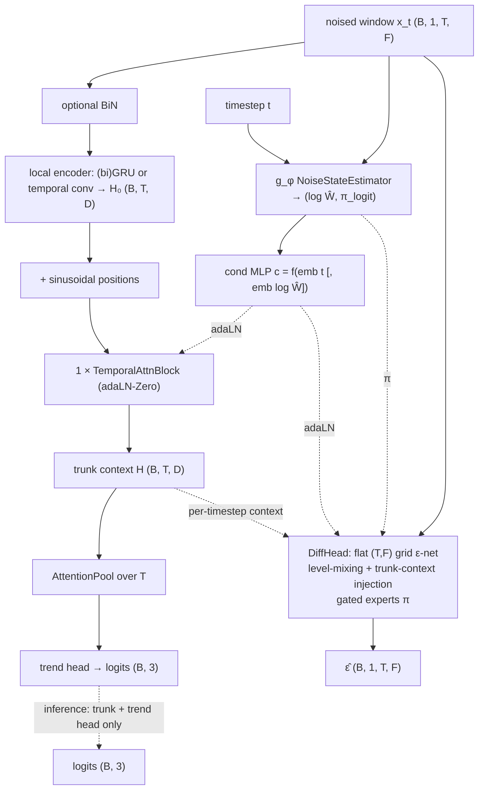

# JumpGateLOB

A **Lévy, jump-aware joint diffusion–classifier** designed specifically for
**feature-only trend inference**. This is a joint diffusion–classifier where the
diffusion task is a **training-time auxiliary** whose only job is to shape the shared
trunk's features. At inference nothing diffuses — you run a single cheap forward pass
through the classifier. Leaner than a deep joint diffusion stack: the global temporal
coupling is a *single* temporal-attention layer on top of a local recurrent encoder,
with a small grid diffusion head sharing the trunk.

- **References:** joint diffusion (Deja et al. 2023); Lévy / jump-diffusion score
  (Baule 2025); noise-state / heavy-tail modelling in the "JumpGate" family.
- **Type:** joint generative–discriminative.
- **Source:** `src/models/jumpgatelob.py`
- **Trainer:** `crypto.train_jumpgatelob`

## The one-sentence picture

You encode a LOB window `x₀ ∈ ℝ^{B×1×T×F}` once through a shared trunk, then hang two
heads off it: a **trend classifier** (kept at inference) and a **grid ε-denoiser**
(discarded at inference). A small noise-state estimator `g_φ` carries the
Lévy/jump machinery. The generative denoising loss regularizes the trunk; the
classifier free-rides on the resulting features.

## The idea

A **shared trunk** (run once per pass) feeds two heads:

- **trend head** — attention-pool over time → 3 logits. **Inference runs only the
  trunk + this head on the clean window** — no reverse sampling.
- **diffusion head** — a small flat `(T, F)` grid ε-predictor conditioned on the trunk
  context, with **gated experts** `ε̂ = (1−π)ε₀ + π·ε₁`.

The trunk returns a 4-tuple `(H, log Ŵ, π_logit, c)`: `H (B,T,D)` is the per-timestep
context shared by both heads, `log Ŵ` / `π_logit` are the noise-state scalars from
`g_φ`, and `c` is the adaLN-Zero conditioning vector. At inference only `H` is used
to produce logits; the other three are discarded.

The trunk is deliberately shallow-global: a **(bi)GRU local encoder** for order-aware
per-timestep context, then **one** DiT-style **temporal self-attention** layer for
global coupling. `(t, log Ŵ)` are injected by adaLN-Zero.

**Lévy machinery** carried by the JumpGate family: a `NoiseStateEstimator` (`g_φ`)
infers `(log Ŵ, π_logit)` — the realized mixing variance and a jump indicator — from
the noised window. `W` comes from a Lévy jump-diffusion forward process (Gaussian
scale mixture; `src/levy/`), and the score is recovered as `−ε/W`. The
`w_conditioning ∈ {none, inferred, oracle}` switch controls whether/what `Ŵ`
conditions the denoiser (with all defaults, it reduces to a plain ε-prediction joint
model).

## Architecture



## Architecture, component by component

The trunk returns `(H, log Ŵ, π_logit, c)`; every block below lives in
`src/models/jumpgatelob.py` (modules in `src/models/modules.py`).

**Noise-state estimator `g_φ`** (`NoiseStateEstimator`) — takes `x_t`, squeezes to
`(B,F,T)`, runs three strided `Conv1d` over time (features as channels, stride 2),
global-average-pools, then an MLP on `[pooled ; emb(t)]` produces two scalars per
sample: the inferred log mixing-variance `log Ŵ` and the jump-gate logit `π_logit`.
It is a *passive side head* unless `w_conditioning ≠ "none"`.

**Conditioning vector `c`** (`DiffusionStepMLP`, from a sinusoidal-step MLP) has
three modes:

- `none` (default): `c = MLP(emb(t))`.
- `inferred`: `c = MLP([emb(t) ; emb(log Ŵ.detach)])`.
- `oracle`: `c = MLP([emb(t) ; emb(log W_oracle)])`.

With the default `w_conditioning="none"`, `c` never sees `Ŵ`, so `g_φ` becomes a
*passive side head* and the joint model collapses to plain ε-prediction — the Lévy
scalar still shapes the forward noise, but not the conditioning.

**Local encoder** (`_local`) — `x` is squeezed to `(B,T,F)`, optionally passed
through `BiN`, then a `(bi)GRU` (`jgl_local="gru"`) or a `Linear`+temporal-conv stack
(`jgl_local="conv"`) maps it to `H₀ ∈ ℝ^{B×T×D}` (`D = 2·gru_hidden` when
bidirectional). A GRU is safe here because the window ends at the prediction point and
the label lives strictly outside it. Sinusoidal positional embeddings are added.

**One attention layer** (`TemporalAttnBlock`) — the *only* global temporal-coupling
layer, a single DiT-style block over `T`:

> `h = H₀ + g₁ ⊙ Attn(mod(LN(H₀), γ₁, β₁))`
> `H = h  + g₂ ⊙ MLP(mod(LN(h),  γ₂, β₂))`

where `mod(z, γ, β) = (1+γ) ⊙ z + β` and the six modulation params
`(γ₁, β₁, g₁, γ₂, β₂, g₂)` are predicted from `c` via `ada = SiLU → Linear(c → 6D)`
with zero init (adaLN-Zero → identity at init). MHA does the self-attention over `T`.

**Trend head** — `H → AttentionPool_T → Dropout → Linear(D → 3)`:
`α_τ = softmax_τ(wᵀ H_τ)`, pooled `= Σ_τ α_τ H_τ`, then 3 logits. This is the only
path that survives to inference.

**Diffusion head** (`DiffHead` — flat grid ε-net, **no U-Net pooling**):
`x_t → Conv2d(1→C, 1×1)`, then `n_blocks` `DiffBlock`s, each doing `GroupNorm →
adaLN(c) → add per-timestep trunk context Linear(D→C)(H) broadcast over F →
feature-mix over F (LevelAttention or 1×3 conv) → gated residual`. Two output `1×1`
convs give the gated experts:

> `ε̂ = (1−π)·ε₀ + π·ε₁`, with `π = σ(π_logit)`.

so the denoiser is conditioned on the diffusion step / `W` (via `c`), the trunk
context `H`, and the jump gate `π`. The `gate_grad` switch controls whether `π` is
detached (`"detach"`, default) or lets gradient flow (`"flow"`).

## I/O

- **Input** `(B, 1, T_past, n_features)`
- **Output (train)** `ε̂`, logits, `log Ŵ`, `π_logit`; **(inference)** `(B, 3)` logits
  from the clean-window trunk pass.

## Training objective

Joint, with **separate passes** so the trend head always sees the clean-window
distribution it will see at inference:

```
L_cls  = CE(classify(x₀), label)                 # clean pass, t = 0
L_diff = ‖ ε̂ − ε ‖²                              # noised pass, sampled t
L_W    = MSE(log Ŵ, log W) + BCE(π_logit, jump_flag)     # trains g_φ
L_jump = BCE(π_logit, data_jump)                 # self-supervised market-jump nudge
L      = L_cls + λ_diff·L_diff + μ_W·L_W + μ_jump·L_jump
```

Defaults: `λ_diff = 1.0`, `μ_W = 0.1`, `μ_jump = 0.05`. Two forward passes per step:
a clean one at `t = 0` (so the classifier sees exactly what it sees at inference) and
a noised one at sampled `t`. `g_φ's` outputs are **detached everywhere except in
`L_W` / `L_jump`** (and the gate mixture when `gate_grad="flow"`), so `g_φ` is trained
only by its own supervision and does not leak gradients into the trunk elsewhere.
Optimizer is AdamW with warmup/cosine LR.

`(x_t, ε, W, jump_flag)` come from the Lévy forward process (`fp.add_noise_eps`, or a
Gaussian bypass). `g_φ` outputs are detached everywhere except `L_W` / `L_jump`.
**Model selection and early stopping are on trend-head macro-F1** (feature-only), not
denoising MSE, and both train/val F1 are logged so the noise-fitting gap is visible.

### How the flags are detected

Two distinct jump signals feed `g_φ`; both are computed in the trainer
(`src/crypto/train_jumpgatelob.py`):

- **Forward-process `jump_flag`** (drives the `BCE` inside `L_W`) — comes from the Lévy
  forward kernel `fp.add_noise_eps`, which returns `(x_t, ε, W, jump_flag)`. It is
  `jump_flag = 𝟙{N > 0}`, i.e. whether the compound-Poisson jump count
  `N ~ Poisson(Λ_t)` drew at least one jump when building that sample's variance `W`.
  With `process=gaussian`, `N` is always 0 so `jump_flag` is all-zero and that `BCE`
  term goes quiet.
- **Data `data_jump_flag`** (drives `L_jump`, the self-supervised market-jump nudge) —
  computed by `_data_jump_flag(x₀, k)` from the **clean** window: average the features
  across levels to a 1-D series, take first differences, and flag the sample when the
  max absolute increment exceeds `k` (= `jump_rv_k`, default 4.0) times the series'
  realized volatility (its std). This is a data-driven proxy for an actual market jump
  in `x₀`, independent of the diffusion noise — it nudges `π_logit` to also recognize
  real LOB discontinuities, not just synthetic forward-process jumps.

At validation, `_validate_noise_state` reports `logW` RMSE and the jump-detector AUROC
(forward `jump_flag` vs `σ(π_logit)`), so `g_φ`'s quality is monitored separately from
the classifier F1.

### Modes

| Flag | Behaviour |
|------|-----------|
| *(default)* | joint — all losses each step |
| `--process gaussian` | ablation: Gaussian forward process instead of Lévy |
| `--baseline` | plain classifier — `L_cls` only, no diffusion / `g_φ` |
| `--baranchuk` | two-phase diagnostic — phase 1 diffusion only, phase 2 freeze trunk + train trend head on frozen features |

Three run modes: `joint` (default, all terms), `--baseline` (`L_cls` only — a
pure-classifier reference with no diffusion and no `g_φ`), and `--baranchuk`
(phase 1 diffusion-only, then freeze the trunk and train a trend head / linear probe
to measure how linearly-decodable the diffusion features are).
`--process levy|gaussian` toggles the forward kernel. Selection and early stopping are
on **validation macro-F1 of the feature-only classifier**, restricted to epochs where
the trend head is actually trained — not on denoising MSE. Each epoch logs `train_f1`
and `f1_gap = train_f1 − val_f1` as a noise-fitting signal.

## Inference

Only the cheap classification path runs — no denoiser, no `g_φ` gating of the output,
no reverse sampling:

> `H, _, _, _ = trunk(x, t=0, log W_oracle=None)`
> `logits = TrendHead(H) ∈ ℝ^{B×3}`

The diffusion head, the jump gate, and the entire forward process exist purely to
shape the trunk during training. `run_test` (`utils.evaluate`) writes accuracy,
macro-F1, the confusion matrix, and per-class precision/recall/F1 to `metrics.json`.

## Config keys

Backbone: `jgl_local` (`gru`/`conv`), `jgl_gru_hidden`, `jgl_gru_layers`,
`jgl_bidirectional`, `jgl_attn_heads`, `jgl_diff_channels`, `jgl_diff_blocks`,
`jgl_feat_mix` (`attn`/`conv`), `jdl_time_emb`, `use_bin`.
JumpGate: `w_conditioning` (`none`/`inferred`/`oracle`), `gated_experts`,
`gate_grad`, `jg_gphi_hidden`.
Loss: `lambda_diff`, `mu_W`, `mu_jump`, `jump_rv_k`.
Lévy forward: `diffusion_process`, `schedule`, `levy_jump_rate`, `levy_gamma_shape`,
`levy_gamma_scale`.

## Run

```bash
uv run python -m crypto.train_jumpgatelob configs/crypto/nobitex/jumpgatelob/btcirt_ofi_k10.json
uv run python -m crypto.train_jumpgatelob ... --baseline    # plain-classifier reference
```

> Configs ship for **Nobitex** (`configs/crypto/nobitex/jumpgatelob/`).

## The Lévy forward process (`src/levy/`)

Shared with [JointDiT-Lévy](jointdit.md#5-lévy-jump-diffusion--cryptotrain_jointdit_levy).
The additive perturbation at step `t` is `u = √W · ξ`, `ξ ~ N(0, I)`, with

With a VP linear-`β` DDPM schedule, `a_t = √ᾱ_t`, `σ_t = √(1−ᾱ_t)`,
`ᾱ_t = Π_{s≤t}(1−β_s)`, and `ε ~ 𝒩(0, I)`:

- `W = σ_t²` for the Gaussian path (`jump_flag = 0`).
- `W = σ_t² + Σ_{k=1}^{N} S_k` for the Lévy path, with `N ~ Poisson(Λ_t)` and
  `S_k ~ Gamma(shape, scale)`.
- Forward state: `x_t = a_t·x₀ + √W·ε`.
- Jump intensity `Λ_t = jump_rate·(t+1)/T` grows with the diffusion step.
- `jump_flag = 𝟙{N > 0}`.

`W` is a **single scalar per sample** — the whole window is scaled uniformly — so this
is a normal variance-mixture: a random compound-Poisson–Gamma variance injected on top
of the Gaussian schedule, heavier-tailed to mirror LOB price jumps. Setting
`process=gaussian` collapses it to `W = σ_t²` (plain DDPM).

The additive perturbation at step `t` is `u = √W · ξ`, `ξ ~ N(0, I)`, with

```
W = σ_t²  +  Σ_{k=1}^{N} S_k,   N ~ Poisson(Λ_t),   S_k ~ Gamma(shape, scale)
```

— a Brownian variance plus a compound-Poisson sum of gamma subordinators. Because the
whole kernel is a **Gaussian scale mixture**, its isotropic score
`∇log q = −u·h(|u|)` needs only a 1-D table `h(r) = E[1/W | r]`, precomputed offline by
Monte-Carlo over `W` (`levy.diffusion.build_score_table`). `Λ_t = 0` recovers the
ordinary Gaussian score exactly. JumpGateLOB uses the **ε-prediction** path (the score
table is bypassed with `table_num_r = 1`); JointDiT-Lévy uses the tabulated score
directly.

## Score recovery (a note worth double-checking)

`recover_score` implements `s(ε̂, W) = −ε̂ / W` and is used only by sampling utilities —
never at inference. For `x_t = a_t·x₀ + √W·ε` with `x_t | x₀ ~ 𝒩(a_t·x₀, W·I)`, the
exact conditional score is `∇_{x_t} log p = −ε / √W`, whereas the doc/code lists
`−ε̂ / W`. If that is a deliberate generalized-score convention for the Lévy kernel,
ignore this — but since it is only used by sampling utilities and never at inference,
it will not affect reported F1 either way.

## Supporting modules (`src/models/modules.py`)

- **`BiN`** — bilinear normalization on `(B,T,F)`: learns a softmax-weighted convex
  mix of a temporal branch (z-score each feature across `T`) and a feature branch
  (z-score each timestep across `F`), removing level/scale non-stationarity between
  train/val/test regimes. Optional front-end (`use_bin`); applied only to the trunk
  encoder input so the raw noised window feeding the diffusion head keeps the ε target
  unchanged.
- **`AttentionPool`** — single learned query attends over a `(B,N,D)` sequence to give
  `(B,D)`. Drop-in replacement for mean/adaptive pooling before the classification
  head; the summary is a learned weighted combination of tokens.
- **`NoiseStateEstimator`** (`g_φ`) — strided `Conv1d` stack over the time axis
  (features as channels) → global average pool → MLP on `[pooled ; emb(t)]` → two
  scalars `(log Ŵ, π_logit)` per sample.
- **`DiffusionStepMLP`** — builds the per-block conditioning vector `c` from `t`
  (and optionally `logW`), the only place the inferred/true noise state enters the
  denoiser; selected by `w_conditioning`.
- **`LevelAttention`** — self-attention across the `F` book levels, per
  `(batch, timestep)`: every level attends to every other level (cross-level mixing).
