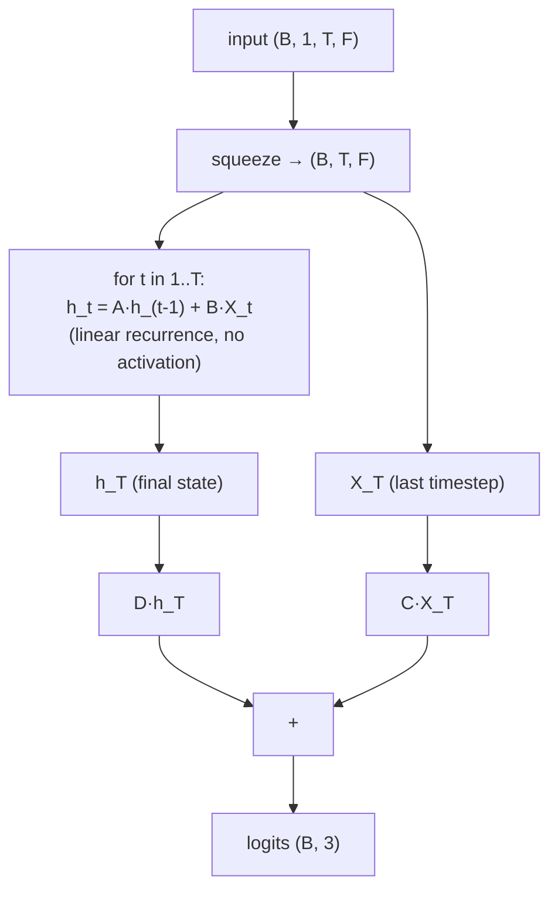

# LinVAR

Linear-recurrent (VAR-style) classifier with a softmax readout — the "linear VAR
baseline" from the deep-LOB literature (e.g. Sirignano & Cont, 2019, *Universal
features of price formation*), trained end-to-end on the trend labels.

- **Type:** discriminative classifier (linear-recurrent).
- **Source:** `src/models/linvar.py`
- **Trainer:** `crypto.train_linvar`

## Idea

A **linear** recurrent state accumulates the order-book feature stream over the
window, and a linear readout maps it to class logits — no nonlinearity anywhere:

```
h_t   = A·h_{t-1} + B·X_t                 # linear recurrent state (no activation)
logit = C·X_T     + D·h_T  → softmax(3)   # readout at the window's last step
```

The source formulation is a binary logistic head (`P(price_t > 0)`); this repo's task
is 3-class down/flat/up, so the logistic link becomes a 3-way softmax. Trained with the
exact same protocol (cross-entropy, AdamW, early stopping on val CE) and evaluated on
the exact same `stride=1` windows as every neural model, so it sits directly in the
same comparison table — the linear-*recurrent* floor, one step up from the linear-
*static* `LogReg`.

## Architecture



## I/O

- **Input** `(B, 1, T_past, n_features)`
- **Output** `(B, 3)` trend logits.

## Config keys

| Key | Meaning | Default |
|-----|---------|---------|
| `linvar_hidden` | recurrent state size `h` | 32 |

## Training

Plain supervised classification — cross-entropy on the trend label, AdamW + warmup/
cosine LR, early stopping on validation cross-entropy (shared protocol, see
[README](README.md#shared-training-protocol)).

```bash
uv run python -m crypto.train_linvar configs/crypto/nobitex/linvar/btcirt_ofi_k10.json
```

## Why it's here

`LogReg` is linear but *static* — it sees the whole window at once with no notion of
order. `LinVAR` adds a linear **recurrence** over time (the same mechanism as a VAR /
linear state-space model) while staying strictly linear-in-features, so it isolates
"does linear temporal accumulation help, before any nonlinearity?" — the step between
`LogReg` and the nonlinear deep models (DeepLOB, CTABL, TLOB, …).

## Relationship to the econometric ARIMA / VAR baselines

`docs/models/arima.md` and `docs/models/var.md` (statistical, *generative* forecast
baselines — fit once or per-window, then threshold a forecasted price move) are a
different paradigm from `LinVAR`. An "ARIMA classifier" trained the same way `LinVAR`
is would collapse into a degenerate special case of it: ARIMA's AR component is a
linear recurrence on price alone (a strict subset of what `LinVAR` learns from the full
feature vector), and its MA component has no analogue once there is no price forecast
to take residuals against. VAR's substance — linear dynamics of the feature vector — is
exactly what `LinVAR` *is*, discriminatively trained instead of fit as a generative
forecaster. So `LinVAR` is the correct trained-classifier counterpart to VAR; ARIMA
stays a generative-only baseline.
