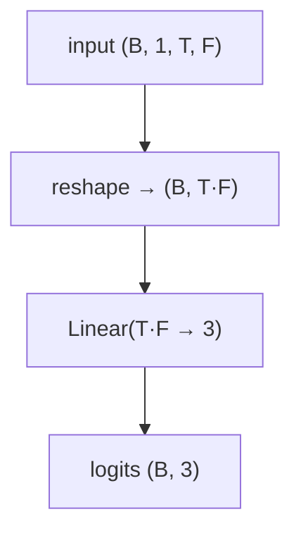

# LogReg

Multinomial logistic regression on the flattened LOB window — the linear floor for
the trend-classification benchmark.

- **Type:** discriminative classifier (linear).
- **Source:** `src/models/logreg.py`
- **Trainer:** `crypto.train_logreg`

## Idea

Flatten the `(T_past × F)` normalized feature window to a single vector and apply one
affine layer straight to 3 class logits — no hidden layers, no nonlinearity. Trained
with the exact same protocol (cross-entropy, AdamW, early stopping on val CE) and
evaluated on the exact same `stride=1` windows as every neural model, so its accuracy/
macro-F1 are directly comparable — it answers "how much does nonlinearity buy you over
a linear combination of the same features?"

## Architecture



## I/O

- **Input** `(B, 1, T_past, n_features)`
- **Output** `(B, 3)` trend logits.

## Training

Plain supervised classification — cross-entropy on the trend label, AdamW + warmup/
cosine LR, early stopping on validation cross-entropy (shared protocol, see
[README](README.md#shared-training-protocol)). Weight decay is the model's only
regularisation (acts as L2 on the linear weights).

```bash
uv run python -m crypto.train_logreg configs/crypto/nobitex/logreg/btcirt_ofi_k10.json
```

## Why it's here

Every other model in this repo learns nonlinear structure over the LOB window.
LogReg strips that away and keeps only a linear combination of the same normalized
features, trained and evaluated on the identical `stride=1` splits — the honest
apples-to-apples floor for judging whether the deeper architectures earn their
complexity.
