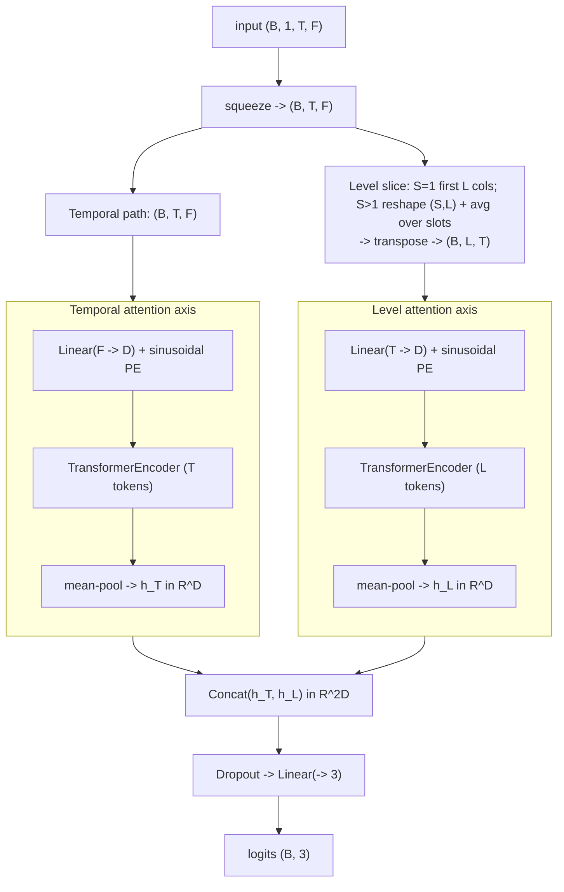

# OF-SATNet — Order-Flow Single-Asset Transformer

Multi-axis attention Transformer over temporal and order-book-level dimensions of
per-level order flow imbalance (OFI). The single-asset ablation of OF-MATNet.

- **Reference:** Bandealinaeini, Sharifkhani & Salavati, *Attention-Based Multi-Asset
  Order Flow Networks for Enhanced Mid-Price Prediction*, ICAIF '25
  (ACM 3768292.3770430).
- **Type:** discriminative classifier.
- **Source:** `src/models/ofsatnet.py`
- **Trainers:** `crypto.train_ofsatnet`, `stocks.feishu.train_ofsatnet`

## Idea

The paper's full model, **OF-MATNet**, attends over three axes of a multi-asset OFI
tensor — **temporal**, **cross-asset**, and **order-book level** — where the
cross-asset axis is built from peer assets pre-selected via rolling-window Granger
causality. **OF-SATNet is the paper's own single-asset baseline** (Section 5.3):
with only one asset (`N = 1`), cross-asset attention carries no information, so it
drops out and only the **Temporal** and **Level** paths remain. This repo implements
that single-asset variant only — the cross-asset / Granger-causality machinery is
out of scope by design, not an omission.

Each remaining path is a standard `nn.TransformerEncoder` with sinusoidal positional
encoding, applied along a different reshaping of the input window:

- **Temporal path** — sequence of `T` per-timestep feature vectors; attention finds
  temporal dependencies in how the full feature vector evolves.
- **Level path** — sequence of `L` per-level OFI series (the first `L` feature
  columns, each transposed to a length-`T` series); attention finds dependencies
  across order-book depth.

The two pooled path embeddings are concatenated and mapped to the output —
`h_final = Concat(h_T, h_L)` (Eq. 7 in the paper, minus the `h_N` cross-asset term).

## Architecture



## I/O

- **Input** `(B, 1, T_past, n_features)`.
- **Output** `(B, 3)` trend logits.

### Level-path input layout

The Level path needs the `L` per-level OFI series, but how the `L` levels sit in the
feature vector differs between the two pipelines — controlled by
`ofsatnet_level_slots` (`S`):

- **Crypto (`S = 1`, default).** The first `L` feature columns *are* the per-level
  OFI (level `0..L-1`; see `crypto/features.py` OFI mode), so the Level path slices
  `[:, :, :L]` directly — a genuine depth axis.
- **Feishu (`S = 24`).** Feishu's OFI block is a flattened `S × L` intraday grid
  (`S=24` ten-minute slots × `L=10` levels, row-major; see
  `stocks/feishu/features.py`). Slicing `[:, :, :L]` would pick only slot 0's
  levels (one, often zero-filled, intraday slot). Instead the first `S*L` columns
  are reshaped to `(S, L)` and **averaged across the `S` slots per level**,
  recovering a true length-`L` level axis aggregated over the trading day.

## Config keys

| Key | Meaning | Default |
|-----|---------|---------|
| `ofsatnet_levels`      | order-book levels `L` forming the Level path (paper: `L=10`); `ofsatnet_level_slots * L` must be `<= n_features` | 10 |
| `ofsatnet_level_slots` | `S`: intraday slots the OFI block is organized into. `1` = first `L` columns are the per-level slice (crypto); `>1` reshapes the first `S*L` columns to `(S, L)` and averages across slots per level (Feishu) | 1 |
| `ofsatnet_dim`         | shared projection dim `D`                        | 64 |
| `ofsatnet_heads`       | attention heads per Transformer encoder           | 4 |
| `ofsatnet_layers`      | Transformer encoder layers per path               | 2 |
| `ofsatnet_ff_dim`      | feed-forward dim inside each encoder layer        | `4 * ofsatnet_dim` |
| `ofsatnet_dropout`     | dropout (encoder + head)                          | 0.1 |

## Training

Supervised cross-entropy under the shared protocol (this repo's benchmark task is
3-class trend classification; the paper's own objective is MSE on the next-step
return — see [README](README.md#shared-training-protocol)).

```bash
uv run python -m crypto.train_ofsatnet configs/crypto/nobitex/ofsatnet/usdtirt_ofi_k10.json
uv run python -m stocks.feishu.train_ofsatnet configs/stocks/feishu/ofsatnet_ofi.json
```
