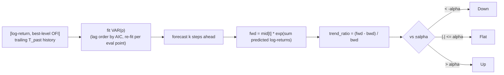

# VAR

A classical bivariate statistical baseline: no learned weights, no shared trunk —
included as a linear-multivariate floor, one step up from ARIMA, that gets to see one
order-flow feature (best-level OFI) alongside price.



## Procedure

At every evaluation point `t` (walk-forward, no-lookahead, same `centre` convention as
the neural datasets):

1. Build a bivariate series over the trailing `T_past` window: `log-return` of the mid
   price and the (z-scored) best-level net Cont-OFI feature (column 0 of the `ofi`
   feature layout).
2. Fit `VAR(p)` with lag order chosen by AIC up to `var_maxlags`.
3. Forecast `label_k` steps ahead; integrate the predicted log-returns to a forward
   price: `fwd = mid[t] * exp(sum(predicted log-returns))`.
4. Compute `bwd = mean(mid[t-k:t])` and `trend_ratio = (fwd - bwd) / bwd`, bucketed with
   the same `alpha` used for the neural models' labels.

If the VAR fit fails (e.g. near-singular window), the forecast falls back to a
random-walk prediction rather than crashing the run.

## Why it's here

VAR adds exactly one microstructure signal (order-flow imbalance) to ARIMA's pure price
history, in a fully linear model. It tests whether the gains from the neural LOB models
come from genuinely nonlinear structure across the *full* book, or whether a linear
combination of price and top-of-book flow already captures most of the predictable
trend.

## Cost note

Re-fitting per evaluation point is expensive, so evaluation points are subsampled via
`eval_stride` (defaults to `max(stride, label_k)`), same as ARIMA.

## Config

`configs/crypto/nobitex/var/btcirt_ofi_k{10,20,50,100}.json` — `var_maxlags` (default
`5`), `eval_stride`, plus the shared `T_past` / `label_k` / split fields.

```bash
uv run python -m crypto.train_var configs/crypto/nobitex/var/btcirt_ofi_k10.json
```
