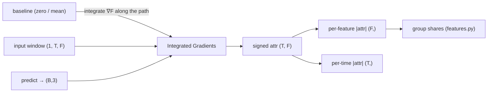

# Feature attribution — Integrated Gradients

*Which inputs move the logit?* Integrated Gradients (IG) attributes each model's
prediction back to the `(T_past, F)` input window, model-agnostically.

- **Reference:** Sundararajan, Taly & Yan, *Axiomatic Attribution for Deep
  Networks*, ICML 2017 — via [captum](https://captum.ai).
- **Type:** input attribution (Layer 1 of the [three-layer story](README.md)).
- **Source:** `src/xai/attribution.py`, `src/xai/features.py`
- **Runner:** `xai.run_ig` → `ig_<baseline>.json` / `ig_<baseline>.npz`

## Idea

Every Penny classifier exposes `predict(batch, device) → (B, 3)`, so **one IG
implementation covers CTABL, DLA and JumpGateLOB with no per-model branching**
and the numbers are directly comparable across them. IG integrates the gradient
of the target logit along the straight path from a baseline to the real input,
so it explains `F(x) − F(baseline)` and satisfies completeness (attributions sum
to that difference).

The runner attributes each window's **own argmax class** (`target="predicted"`)
by default — explaining what the model *did* — with `target="label"` available
to attribute the ground-truth class instead.



## The baseline

Attribution is always *relative to a baseline*, so the baseline defines what "no
contribution" means. Two are provided:

| `baseline` | Meaning | Role |
|------------|---------|------|
| `zero` (default) | the genuine **no-order-flow** state | the reported attribution |
| `mean` | mean training window | the robustness check |
| *(tensor)* | an explicit baseline | escape hatch |

Zero is not an arbitrary origin here. Features are z-scored by a **causal
trailing rolling** window (`crypto.loader`), and per-level OFI is signed and
near-stationary, so a true no-flow row (raw OFI = 0) lands at z ≈ 0 (≈ 0.04 ± 0.08
at level 1, tightening to ≈ −0.003 ± 0.012 by level 20). And raw per-level OFI is
**exactly zero in 25–36% of bins** (a quiet book), so the baseline sits on the
single most common state in the data rather than off-manifold — the usual
objection to zero baselines does not bite. "What would this prediction be with no
order flow?" is Cont's own null and the counterfactual an OFI paper is asking.

`mean` agrees with `zero` at **Spearman ≈ 0.99** on feature rankings, so
conclusions do not hinge on the choice — which is worth reporting rather than
assuming.

> **Units caveat.** The rolling z-score makes the `z → raw` map time-varying.
> Attributions are comparable in normalised space, but converting them to raw OFI
> units requires de-scaling each row by that row's own `std`, never a single
> global constant.

## Feature groups

A raw `(T, F)` attribution grid is unreadable; `features.py` sums it into named
economic blocks that mirror `crypto/features.py` exactly (see
[docs/data/features.md](../data/features.md)). Names and groupings are derived
from the config, so they stay correct for either `feature_mode` and any
`n_lob_levels`.

For `ofi` mode the groups are:

| Group | Columns |
|-------|---------|
| `OFI_best` | top `best_levels` (default 3) OFI levels |
| `OFI_deep` | remaining OFI levels |
| `microstructure` | spread/mid, depth-imbalance, log-return |
| `trade` | buy/sell vol, trade-imbalance, count, vwap-dev |
| `quote_activity` | activity, spread-norm, |log-return| |

The best/deep split at `best_levels` is deliberate: Cont's OFI theory predicts
price impact concentrates at the top of the book, so keeping "best" and "deep"
apart makes that prediction **testable rather than decorative**.
`group_attribution` returns each group's *share* of the total by default, so the
numbers compare across models.

## I/O

- **Input** the model's `predict` contract + a windowed `dataset` (items give
  `"x"` `(1, T, F)` and `"label"`).
- **Output** a dict with `per_feature` `(F,)`, `per_time` `(T,)`, signed
  `attr_mean` `(T, F)`, `targets`, `labels`, and the **completeness error**
  (`|Σ attr − (F(x)−F(base))|` max over windows) — reported so a too-coarse
  `n_steps` cannot pass silently.

## Cost & batching

IG costs `n_steps` forward+backward passes per window, and captum expands each
window `n_steps` times, so the network really sees `batch_size × n_steps` samples
at once. The IG batch is therefore capped to keep that product near a budget
(`_IG_BATCH_BUDGET = 1024`) rather than reusing the training `batch_size` — at
64×64 = 4096 windows DLA's per-timestep Python LSTM loop is killed by the OS with
no traceback. Because the full test split rarely justifies the cost, a random
`n_windows` subsample (default 2048, seeded) is used.

> **GPU note (recurrent models).** cuDNN refuses to backprop through an RNN in
> `eval()` mode, which IG requires; the attribution call is scoped inside
> `torch.backends.cudnn.flags(enabled=False)` to fall back to the numerically
> equivalent native kernel. This is a no-op on CPU and only affects JumpGateLOB
> and DLA on GPU.

## Running

```bash
uv run python -m xai.run_ig checkpoints/nobitex/BTCIRT/ctabl_BTCIRT_ofi_k10
uv run python -m xai.run_ig <ckpt_dir> --baseline mean --n-windows 1024 --n-steps 128
```

Writes `ig_<baseline>.npz` (arrays) and `ig_<baseline>.json` (group shares +
provenance) into the checkpoint directory, where the downstream faithfulness,
CKA and agreement stages re-read the same window subsample.

The faithfulness check that licenses reading these numbers is in
[faithfulness.md](faithfulness.md).
