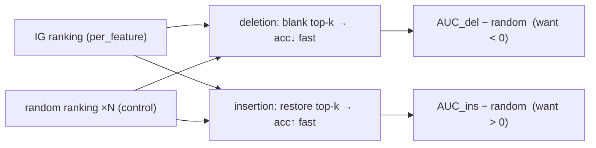

# Faithfulness — deletion / insertion

*Do the attributions actually predict behaviour?* A plausible-looking attribution
map is worth nothing on its own; this is the behavioural test that licenses
reading the [IG](attribution.md) numbers at all.

- **Reference:** Petsiuk, Das & Saenko, *RISE* (deletion/insertion metric),
  BMVC 2018.
- **Type:** attribution sanity check (Layer 1 of the [three-layer story](README.md)).
- **Source:** `src/xai/faithfulness.py`
- **Runner:** `xai.run_faithfulness` → `faithfulness.json`

## Idea

Rank the features by mean `|attribution|`, then sweep how many top-ranked
features are masked, and watch accuracy move:

- **deletion** — start from the real window and progressively replace the
  top-ranked features with the baseline. Faithful attributions make accuracy fall
  **fast**.
- **insertion** — start from an all-baseline window and progressively restore the
  top-ranked features. Faithful attributions make accuracy recover **fast**.



Each curve is summarised by its area (AUC, mean accuracy across the sweep):
**lower deletion AUC is better, higher insertion AUC is better**.

## The control is the whole point

Both curves are read against a **random ranking** run under the *identical*
masking procedure — averaged over several draws (`n_random`, default 5), because
a single random draw is itself noisy. A curve on its own says nothing about
whether the ordering carried information; the AUC **gap to random** is the
result:

- faithful → **negative** deletion delta and **positive** insertion delta.

## Two things kept honest

- **Same filler as the attribution baseline.** Masking replaces features with the
  *same* baseline IG was computed against (zeros = no order flow by default).
  Using a different filler would score the attributions against a counterfactual
  they never claimed — the usual way this test is quietly rigged.
- **Global ranking.** One feature order for the whole subsample (from the mean
  `|attribution|`), matching how the paper reports attributions. Per-window
  ranking would measure a different, more permissive claim.

Labels come from the dataset, so the sweep measures **real accuracy**, not
agreement with the unmasked prediction.

## I/O

- **Input** a model, dataset, the window `indices` and a `per_feature` `(F,)`
  score vector (typically IG's `per_feature`).
- **Output** per mode (`deletion`, `insertion`): the `fractions`, `accuracy`
  curve, its `auc`, the `random_accuracy` band and `random_auc ± std`; plus a
  top-level `delta` with the two AUC gaps.

## Running

```bash
uv run python -m xai.run_faithfulness checkpoints/nobitex/BTCIRT \
    --models ctabl_BTCIRT_ofi_k10 dla_BTCIRT_ofi_k10 jumpgatelob_levy_BTCIRT_ofi_k10 \
    --baseline zero --n-windows 1024 --n-points 11 --n-random 5
```

Runs all three models over the same windows as [IG](attribution.md), reports the
AUC gap, and writes `faithfulness.json`.
