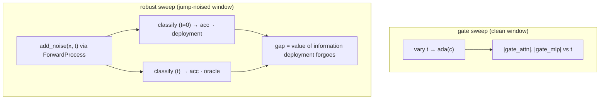

# JumpGateLOB gate / robustness sweep

*How does JumpGateLOB's trunk re-weight itself as the noise level rises?*
Model-specific by construction — this probe exists only because the architecture
has **adaLN-Zero gates** conditioned on a diffusion timestep `t`. CTABL and DLA
have no analogue, so this is not part of the three-way comparison; it is the
reading the diffusion trunk affords and the discriminative baselines do not.

- **Type:** model-specific mechanism sweep (Layer 3 of the [three-layer
  story](README.md)).
- **Source:** `src/xai/gate_sweep.py`
- **Runner:** `xai.run_gate_sweep` → `gate_sweep.json`
- **Depends on:** `crypto.train_jumpgatelob._diffusion_cfg`, `levy.diffusion.forward.ForwardProcess`

## Two sweeps, which must not be conflated

### `gate` — the learned noise schedule

Feed a **clean** window and vary only the `t` conditioning. The adaLN-Zero gates
(`gate_attn` / `gate_mlp` in `TemporalAttnBlock`, scaling each residual write)
are produced by `ada(c)` from the timestep embedding alone, so their magnitude
*is* how much each block writes into the residual stream at that noise level.
This is a statement about the trunk's **learned noise schedule**, not about
accuracy.

### `robust` — did `L_robust` buy anything?

Noise the window at `t` with the **real Lévy jump-diffusion forward process**,
then classify. This reproduces the deployment path and so measures whether the
`L_robust` term actually bought noise tolerance. Built from the checkpoint's own
config, so the swept `t` indexes the schedule the trunk actually saw.



## The `t=0` subtlety

`train_jumpgatelob` classifies *even noised* windows at `t = 0` — "deployment
never knows the noise level" — so `classify(x, t=...)` with `t > 0` is an
**analysis-only** counterfactual that never occurs in training or inference. The
robust sweep therefore reports **both**:

- `accuracy_t0` — the honest deployment path (always `t=0` conditioning);
- `accuracy_oracle` — the trunk told the true noise level.

The **gap** between them is the value of information the deployed model
deliberately forgoes.

## The trained region

`low_t_boundary` returns the largest `t` in the SNR ≥ 1 band the robust loss
trained on (VP: `abar_t ≥ 0.5`). Accuracy inside this band is what `L_robust`
optimised; beyond it the model extrapolates, so the table marks the band with `*`
and the two regimes should not be read as one curve.

## I/O

- **Input** the JumpGateLOB checkpoint, its dataset, window `indices`, and the
  swept `timesteps`.
- **Output** `gate` → `{t, gate_attn, gate_mlp}`; `robust` →
  `{t, accuracy_t0, accuracy_oracle}`.

## Running

```bash
uv run python -m xai.run_gate_sweep \
    checkpoints/nobitex/BTCIRT/jumpgatelob_levy_BTCIRT_ofi_k10 \
    --n-windows 1024 --n-points 11
```

Runs both sweeps and writes `gate_sweep.json` beside the checkpoint. The gates it
reads are part of the [attention readouts](attention-readouts.md) exposed by
`return_attn=True`.
